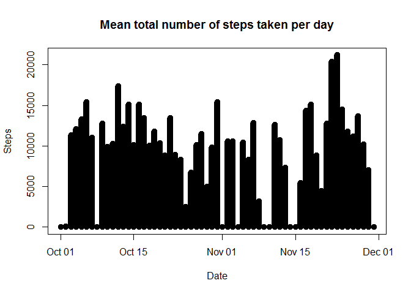
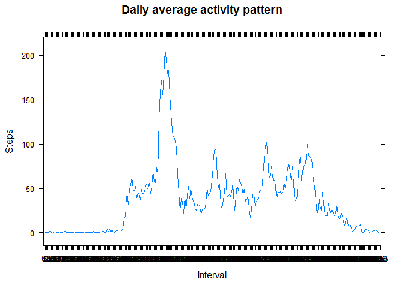
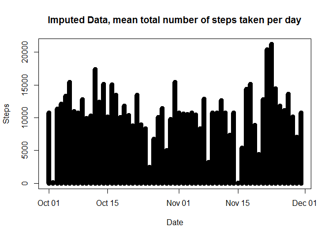
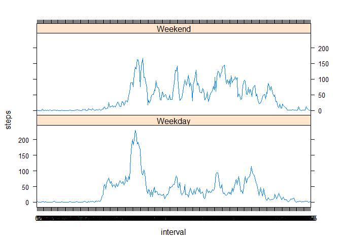

# Reproducible Research: Peer Assessment 1


## Loading and preprocessing the data


```r
unzip("activity.zip")
activity <- read.csv("activity.csv")
activity$date <- as.Date(activity$date)
```

## What is mean total number of steps taken per day?


```r
dailySteps <- aggregate(x = activity$steps, by = list(activity$date), FUN = sum, na.rm=TRUE)
names(dailySteps) <- c("date", "steps")
plot(dailySteps$date, dailySteps$steps, type = "h", lwd = 10, xlab = "Date", ylab = "Steps", main = "Mean total number of steps taken per day")
```

 

```r
mean <- mean(dailySteps$steps)
median <- median(dailySteps$steps)
```
The mean total number of steps taken per day is 9354.2295082 steps/day.

The median total number of steps taken per day is 10395 steps/day.

## What is the average daily activity pattern?


```r
minuteSteps <- aggregate(x = activity$steps, by = list(factor(activity$interval)), FUN = mean, na.rm=TRUE)
names(minuteSteps) <- c("interval", "steps")
library(lattice)
xyplot(steps ~ interval, data = minuteSteps, type = "l", ylab = "Steps", xlab = "Interval", main = "Daily average activity pattern")
```

 

```r
maxSteps <- minuteSteps[minuteSteps$step == max(minuteSteps$steps),]
maxInterval <- maxSteps$interval
```

The maximum average number of steps is achieved at interval 835. 

## Imputing missing values


```r
activityNA <- is.na(activity$steps)
sumNA <- sum(activityNA)
newActivity <- activity
newActivity$steps[activityNA] <- minuteSteps$steps
newDailySteps <- aggregate(x = newActivity$steps, by = list(newActivity$date), FUN = sum, na.rm=TRUE)
names(newDailySteps) <- c("date", "steps")
plot(newDailySteps$date, newDailySteps$steps, type = "h" ,lwd = 10,xlab = "Date", ylab = "Steps", main = "Imputed Data, mean total number of steps taken per day")
```

 

```r
newMean <- mean(newDailySteps$steps)
newMedian <- median(newDailySteps$steps)
```

The total number of missing values in the dataset are 2304.

The mean of the intervals was used to fill in the missing data. 

The new mean total number of steps taken per day is 1.0766189\times 10^{4} steps/day.

The new median total number of steps taken per day is 1.0766189\times 10^{4} steps/day.

The new mean and median are higher than the previous mean and median.

Also the new mean and median values are equaled to each other.


## Are there differences in activity patterns between weekdays and weekends?


```r
newActivity$weekdays <- weekdays(newActivity$date)
newActivity$weekday <- as.factor(ifelse(weekdays(newActivity$date) %in% c("Saturday","Sunday"), "Weekend", "Weekday"))
aggNewActivity <- aggregate(x = newActivity$steps, by = list(factor(newActivity$interval), newActivity$weekday), FUN = mean, na.rm=TRUE)
names(aggNewActivity) <- c("interval","weekday", "steps")

library(lattice)
xyplot(steps ~ interval | weekday, data = aggNewActivity, layout = c(1, 2), type = "l")
```

 


